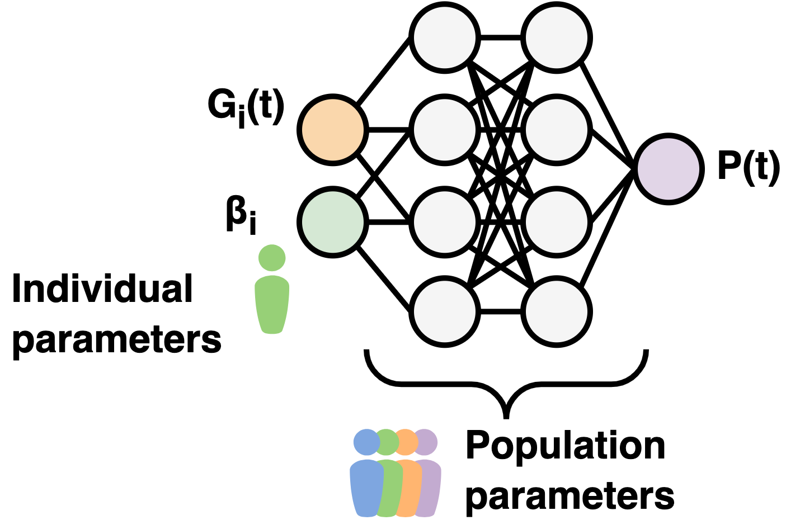

# Conditional UDE
Repository accompanying the manuscript on conditional universal differential equations. The paper can be accessed here:

<!-- ADD CITATION -->



## What is a conditional UDE?
Whereas universal differential equations do not directly accommodate the derivation of model components from data containing variability between samples, such as measurements on individuals in a population, the conditional UDE, combined with its specific training procedure, accounts for this through additional learnable inputs. 

A cUDE is trained with a global neural network parameter set, and a set of conditional parameters that allow for explanation of the between-sample variability. This setup does then require a test set, where the neural network parameters are fixed and only the conditional parameters are estimated.

## Structure of this repository
This repository contains the following folders:
- `assets`: illustrations in the Readme files.
- `c-peptide`: all code surrounding model fits of the UDE and the final symbolic equations on the c-peptide data, as well as the computation of indices of beta-cell function.
- `data`: contains the data and the associated license used for this project.
- `figures`: contains the figures saved from the code.
- `symbolic-regression`: all code and raw result files from the symbolic regression run.

## Dependencies
Dependencies are split between Julia and Python.

### Julia
Used packages and versions are documented in the `Project.toml` file. Julia's package manager `pkg` automatically takes care of installing the correct versions. To install the dependencies, open Julia in the repository path.

```
julia
```

Select the package manager by pressing `]`, and activate the environment.

```
pkg> activate .
```

Instantiate the environment to install the packages:
```
pkg> instantiate
```

### Python
Poetry was used for package management. Packages are included in the `pyproject.toml` file.

## Data sources
The glucose, insulin, and c-peptide data during both the OGTT and the clamp experiments were originally taken from Okuno et al. (2013)[^1], and also used by Ohashi et al. (2015)[^2] and Ohashi et al. (2018)[^3]. As an external dataset, OGTT data from 20 individuals was used from Fujita et al. (2023)[^4]

[^1]: Okuno, Y., Komada, H., Sakaguchi, K., Nakamura, T., Hashimoto, N., Hirota, Y., Ogawa, W., Seino, S.: Postprandial serum c-peptide to plasma glucose concentration ratio correlates with oral glucose tolerance test- and glucose clamp-based disposition indexes. Metabolism: Clinical and Experimental 62, 1470–1476 (2013) https://doi.org/10.1016/j.metabol.2013.05.022

[^2]: Ohashi, K., Komada, H., Uda, S., Kubota, H., Iwaki, T., Fukuzawa, H., Komori, Y., Fujii, M., Toyoshima, Y., Sakaguchi, K., Ogawa, W., Kuroda, S.: Glucose homeostatic law: Insulin clearance predicts the progression of glucose intolerance in humans. PLOS ONE 10, 0143880 (2015) https://doi.org/10.1371/JOURNAL.PONE.0143880

[^3]: Ohashi, K., Fujii, M., Uda, S., Kubota, H., Komada, H., Sakaguchi, K., Ogawa, W., Kuroda, S.: Increase in hepatic and decrease in peripheral insulin clearance characterize abnormal temporal patterns of serum insulin in diabetic subjects. npj Systems Biology and Applications 2018 4:1 4, 1–12 (2018) https://doi.org/10.1038/s41540-018-0051-6

[^4]: Fujita, S., Karasawa, Y., Hironaka, K. I., Taguchi, Y. H., & Kuroda, S. (2023). Features extracted using tensor decomposition reflect the biological features of the temporal patterns of human blood multimodal metabolome. PLoS ONE, 18(2 February). https://doi.org/10.1371/journal.pone.0281594
